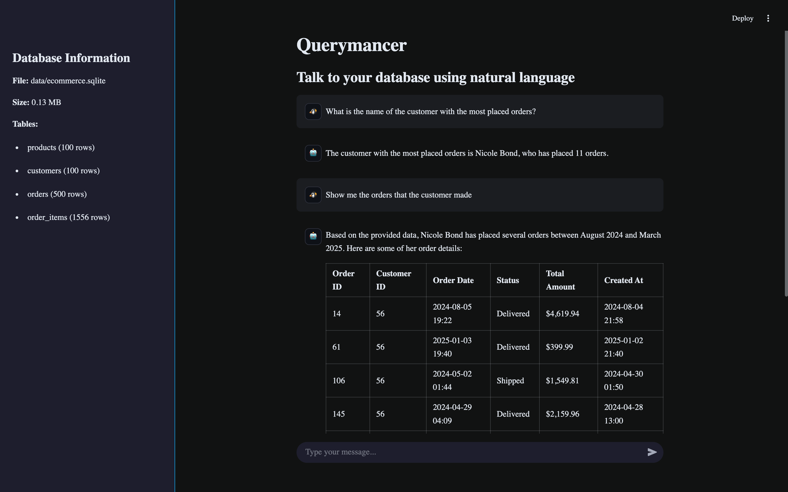

# Querymancer

AI agent that lets you to talk to your database using natural language. All locally.

Features:

- AI Agent that can answer questions about your database
- Works with local SQLite database (can be adapted to others)
- Runs tools (`list_tables`, `sample_table`, `describe_table`, `execute_sql`) and provides reasoning
- Uses Ollama for LLM inference

Read the full tutorial on MLExpert.io: https://mlexpert.io/v2-bootcamp/build-ai-agent

## Install

Make sure you have [`uv` installed](https://docs.astral.sh/uv/getting-started/installation/).

Clone the repository:

```bash
git clone git@github.com:mlexpertio/querymancer.git .
cd querymancer
```

Install Python:

```bash
uv python install 3.12.8
```

Create and activate a virtual environment:

```bash
uv venv
source .venv/bin/activate
```

Install dependencies:

```bash
uv sync
```

Install package in editable mode:

```bash
uv pip install -e .
```

Install pre-commit hooks:

```bash
uv run pre-commit install
```

### Create SQLite database

You can use any SQLlite database. This project comes with a sample script that can create one for you:

```sh
bin/create-database
```

This should create a file called `ecommerce.sqlite` in the `data` directory. Here's a diagram of the database schema:


### Run Ollama

Querymancer uses Ollama for LLM inference. Watch this video to see how to install Ollama: https://www.youtube.com/watch?v=lmFCVCqOlz8

One model you can use is `gemma3-tools:12b`:

```bash
ollama pull PetrosStav/gemma3-tools:12b
```

But I found that it won't work well (not good enough tool support). Another good option is Qwen 2.5 7B:

```bash
ollama pull qwen2.5
```

Feel free to experiment with other models.

### (Optional) Groq API

You can also use models from Groq (get your API key from https://console.groq.com/keys).

Rename the `.env.example` file to `.env` and add your API key inside:

```bash
mv .env.example .env
```

Look into the [`config.py`](querymancer/config.py) file to set your preferred model.


## Run the Streamlit app

Run the app:

```bash
streamlit run app.py
```